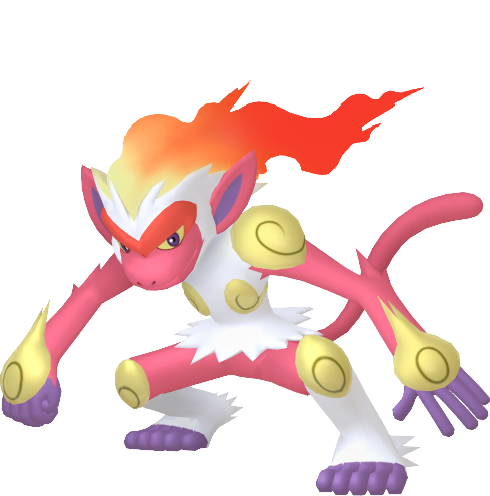
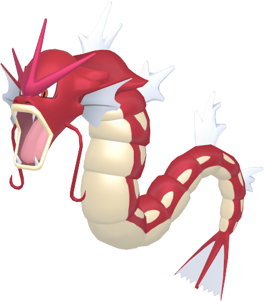
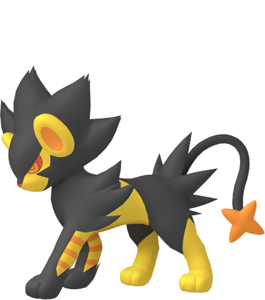
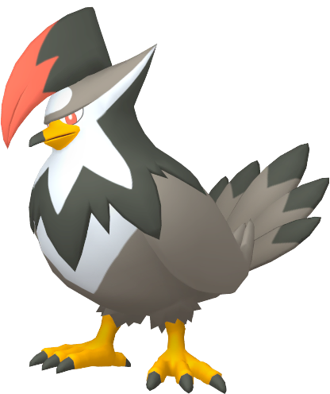
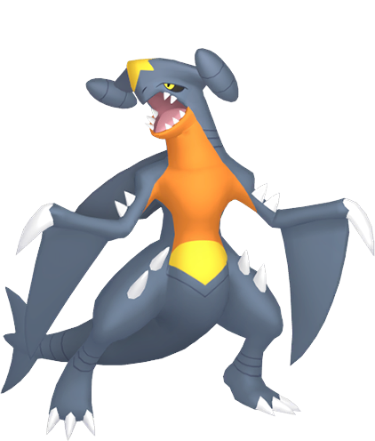

# Pokémon Brilliant Diamond

---

## Infernape

  

### Moves
- Close Combat
- Calm Mind
- Flame Wheel
- Power-Up Punch
### Misc
- **Item:**  
- **Ability:** Blaze  
- **Nature:** Adamant

---

## Gyarados

   

### Moves
- Hyper Beam
- Surf
- Hydro Pump
- Dragon Dance
### Misc
- **Item:**  
- **Ability:** Intimidate
- **Nature:** Bold

---

## Luxray

  

### Moves
- Crunch
- Volt Switch
- Discharge
- Thunder Wave
### Misc
- **Item:**  
- **Ability:** Intimidate
- **Nature:** Lax

---

## Staraptor (Bloodwing)

  

### Moves
- Aerial Ace
- Agility
- Brave Bird
- Close Combat
### Misc
- **Item:** 
- **Ability:** Intimidate
- **Nature:** Modest

---

## Roserade

  

### Moves
- Giga Drain
- Sweet Scent
- Synthesis
- Toxic
### Misc
- **Item:** 
- **Ability:** Nature Cure  
- **Nature:** Adamant

---

## Garchomp

  

### Moves
- Bulldoze
- Crunch
- Sandstorm
- Dragon Claw
### Misc
- **Item:** 
- **Ability:** Sand Veil
- **Nature:** Timid
